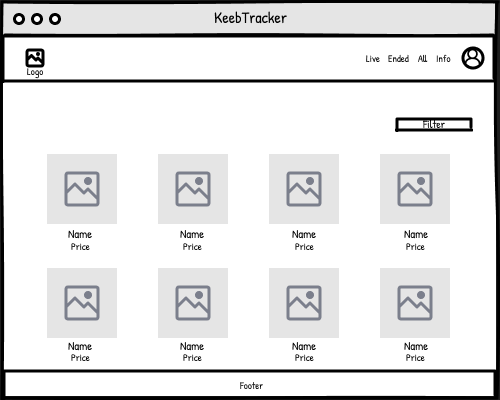

# KeebTracker
A full stack application for all things custom keyboards - tracking upcoming/live/ended group buys, tracking your expenses and arsenal, information on keyboard parts and building


KeebTracker 
=================

<!-- To start the application
* `cd server`
* `npm i` - to install dependencies (dotenv, nodemon, body-parser, cors, express, express validator, mongoose, chai, chai-http, mocha)
* `npm start` - to start the server
* Open another terminal window for the 
* `cd client`
* `npm i` - to install dependencies (jest, react, user-event, axios, bootstrap, react-dom, react-router-dom)
* `npm start` - to start the REACT app
* You can either click the link in the terminal or open "http://localhost:3000"
* Open another client terminal for testing
* `cd client`
* `npm test`
* `cd ..`
* `cd server`
* `npm test` -->

Aim for project:
-------
A full stack application that allows for clients to track expenses, collection, keyboards and browse information for building keyboards


Features:
-------

### Standard Acceptance Criteria
```
As a client
So that I can see what keyboard parts I want to purchase 
I want to view on-going group buys

As a client
So that I can see what keyboard parts I may have missed out on
I want to view recently ended and all past group buys

As a client
So that I can better understand how to build a keyboard
I want to see guides explaining keyboard jargon and step by step guides for each part of the process

As a Client
So that I can track my expenses
I want to be able to add keyboard purchases to my collection

As a Client
So that I can show off what I own
I want to have a profile

As a Client
So that I can use the application's tracking features
I want to sign up for KeebTracker

As a Client
So that only I can update my profile and collection
I want to log in to KeebTracker

As a Client
So that I can avoid others being able to update my profile
I want to be able to log out of KeebTracker

As an Admin
So that I can update pages
I want elevated permissions

As an Admin
So that I can make changes to pages
I want to be able to log in to KeebTracker

As an Admin
So that I can avoid others having access to change pages
I want to be able to log out of KeebTracker
```


## Home page wireframe 



### Component Hierarchy
>- App, Header, LiveGBs, Footer

## Initial Logo


### Logo explanation
>- A keyboard where the highlighted keys display a KT hence KeebTracker and a background that matches the colourtheme of the service. An improvement I would like to make to it would be for the circle surrounding it to be a usb wire coming from the  keyboard itself.
<!-- ## Home page wireframe logged in
<!--  -->


<!-- ### Component Hierarchy
>- App, Header, Post, Peeps, Footer


<!-- ## Log in page -->


<!-- ### Component Hierarchy -->


<!-- ## Register page -->


<!-- ### Component Hierarchy -->


<!-- ### Schema for the GroupBuy & account: -->

<!-- >The account should have a first name , last name, username, email, password where the username and email are unique. --> 
